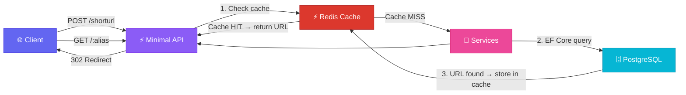
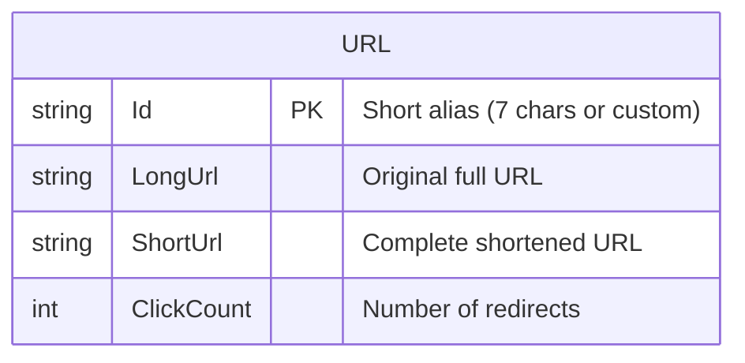

<div align="center">

<!-- Animated Header Banner -->


<!-- Typing Animation -->
<a href="#">
  
</a>

<br/>

<!-- Badges Row 1 -->
[](https://dotnet.microsoft.com/)
[](https://www.postgresql.org/)
[](https://docs.microsoft.com/ef/)
[](https://docs.microsoft.com/dotnet/csharp/)

<!-- Badges Row 2 -->
[](https://redis.io/)
[](#-license)
[](#)
[](#)

<br/>

<!-- Short Description -->
<p>
  <strong>🌐 A sleek, high-performance RESTful API for URL shortening</strong><br/>
  <sub>Built with modern .NET 10 Minimal APIs • PostgreSQL • Entity Framework Core • Redis Cache</sub>
</p>


</div>

<br/>

## 🌟 Features

<table>
<tr>
<td width="50%">

### ⚡ Core Features
| Feature | Description |
|:---:|:---|
| 🔗 | **URL Shortening** — Convert long URLs to short, shareable links |
| ✨ | **Custom Aliases** — Choose your own short URL identifier |
| 🎲 | **Auto Generation** — 7-character random IDs when no alias provided |
| 📊 | **Click Tracking** — Built-in analytics with click counter |

</td>
<td width="50%">

### 🛡️ Technical Highlights
| Feature | Description |
|:---:|:---|
| 🚀 | **Minimal APIs** — Lightweight, high-performance endpoints |
| 🗄️ | **PostgreSQL** — Robust, scalable data storage |
| ⚡ | **Redis Cache** — Cache-aside pattern with 5-minute TTL for fast redirects |
| 📝 | **Scalar Docs** — Interactive API documentation at `/docs` |
| 🔄 | **Auto Redirect** — Seamless HTTP 302 redirection |

</td>
</tr>
</table>

<br/>

## 🏗️ Architecture



<br/>

## 🧰 Tech Stack

<div align="center">

| Layer | Technology | Badge |
|:---:|:---|:---:|
| **Runtime** | .NET 10 |  |
| **Language** | C# |  |
| **Framework** | ASP.NET Core Minimal APIs |  |
| **ORM** | Entity Framework Core 10 |  |
| **Database** | PostgreSQL |  |
| **DB Provider** | Npgsql |  |
| **Cache** | Redis (StackExchange.Redis) |  |
| **Cache Abstraction** | `IDistributedCache` + `IRedisCache` |  |
| **API Docs** | Scalar |  |

</div>

<br/>

## 📁 Project Structure

```
🗂️ ShorterUrls/
│
├── 📂 Cache/                 # Redis Caching Layer
│   ├── IRedisCache.cs        # Cache abstraction (GetData<T>, SetData<T>)
│   └── RedisCache.cs         # IDistributedCache implementation (5-min TTL)
│
├── 📂 Data/                  # DbContext & Database Configuration
│   └── ApplicationDbContext.cs
│
├── 📂 Dtos/                  # Data Transfer Objects
│   ├── urlshortenRequest.cs  # Request DTO (url, alias)
│   └── UrlShortenResponse.cs # Response DTO (shortenUrl)
│
├── 📂 Helpers/               # Utility Classes
│   └── RandomizedCharachters.cs  # Random ID Generator
│
├── 📂 Migrations/            # EF Core Database Migrations
│
├── 📂 Models/                # Domain Models
│   └── Url.cs                # URL Entity (Id, LongUrl, ShortUrl, ClickCount)
│
├── 📂 Properties/            # Launch Settings
│
├── 🟢 Program.cs             # Entry Point & Endpoint Definitions
├── ⚙️ appsettings.json       # App Configuration & Connection Strings
├── 📦 ShorterUrls.csproj     # Project File & Dependencies
└── 📄 README.md              # You are here! 😄
```

<br/>

## 🚀 Getting Started

### 📋 Prerequisites

<div align="center">

| Requirement | Version | Installation |
|:---:|:---:|:---:|
|  | **10.0+** | [Download](https://dotnet.microsoft.com/download) |
|  | **14.0+** | [Download](https://www.postgresql.org/download/) |
|  | **6.0+** | [Download](https://redis.io/download/) |

</div>

### ⚙️ Installation

<details>
<summary><b>📥 Step 1 — Clone the Repository</b></summary>

```bash
git clone https://github.com/Mesh4All99/UrlShorteningService.git
cd UrlShorteningService
```

</details>

<details>
<summary><b>🗄️ Step 2 — Configure Database & Redis Connection</b></summary>

Update the connection strings in `appsettings.json`:

```json
{
  "ConnectionStrings": {
    "Default": "Host=localhost; Port=5432; Database=UrlShorterDb; Username=postgres; Password=YOUR_PASSWORD;",
    "Redis": "localhost:6379"
  }
}
```

> 💡 **Tip:** Make sure Redis is running before starting the application. The default port is `6379`.

</details>

<details>
<summary><b>📦 Step 3 — Apply Migrations</b></summary>

```bash
dotnet ef database update
```

> 💡 **Tip:** If you don't have EF tools installed, run:
> ```bash
> dotnet tool install --global dotnet-ef
> ```

</details>

<details>
<summary><b>▶️ Step 4 — Run the Application</b></summary>

```bash
dotnet run
```

🎉 The API will be available at `https://localhost:7xxx`

📖 **API Documentation** is accessible at `/docs` in development mode (powered by Scalar).

</details>

<br/>

## 📡 API Reference

### 🔗 Shorten a URL

```http
POST /shorturl
Content-Type: application/json
```

<table>
<tr>
<td width="50%">

**📤 Request Body**
```json
{
  "url": "https://example.com/very/long/url/path",
  "alias": "my-link"  // ⬅️ Optional
}
```

</td>
<td width="50%">

**📥 Response** `200 OK`
```json
{
  "shortenUrl": "https://localhost:7xxx/my-link"
}
```

</td>
</tr>
</table>

> [!NOTE]
> - If `alias` is provided → it will be used as the custom short URL identifier
> - If `alias` is omitted → a random 7-character ID will be auto-generated

> [!WARNING]
> - Returns `400 Bad Request` if the URL format is invalid
> - Returns `400 Bad Request` if the alias is already taken

---

### 🔄 Redirect to Original URL

```http
GET /{alias}
```

| Parameter | Type | Description |
|:---:|:---:|:---|
| `alias` | `string` | **Required**. The short URL identifier |

> **Response:** `302 Found` — Redirects to the original long URL & increments click counter

> [!TIP]
> Redirects use a **cache-aside pattern**: the alias is looked up in Redis first (⚡ fast path). On a cache miss, the URL is fetched from PostgreSQL, stored in Redis with a **5-minute TTL**, then the redirect is served. Click counts are incremented on every request.

<br/>

## 📊 Database Schema



<br/>

## 🤝 Contributing

<div align="center">

Contributions are welcome! Feel free to open issues and pull requests.

[](https://github.com/Mesh4All99/UrlShorteningService/issues)
[](https://github.com/Mesh4All99/UrlShorteningService/issues)

</div>

<br/>

## 📄 License

This project is available for free use.

<br/>

<!-- Footer Wave -->


<div align="center">

**⭐ If you found this project helpful, give it a star!**

<br/>

Made with ❤️ using .NET 10

</div>
